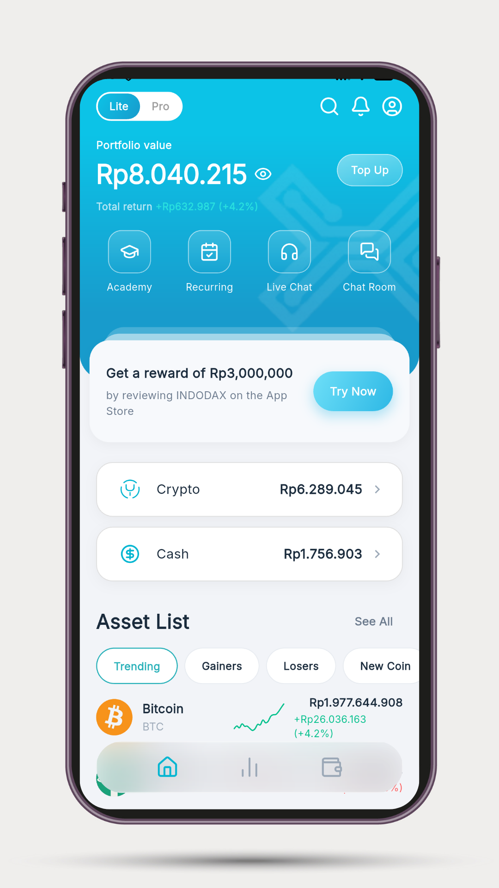
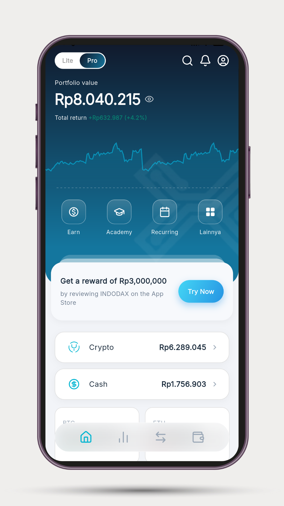

# Indodax Crypto Exchange Redesign App

Redesigned Indodax crypto app with a focus on simplicity and high-stakes functionality.

## Project Overview

This project includes:
- Dashboard and portfolio UI
- Asset detail pages
- Buy/confirm purchase flow components
- Reusable widgets for cards, banners, and quick actions

## Getting Started

### Prerequisites
- Flutter SDK (compatible with Dart `^3.10.0`)
- A connected emulator/device

### Install Dependencies
```bash
flutter pub get
```

### Run Static Analysis
```bash
flutter analyze
```

## Project Structure

Key directories:
- `lib/` - application source code
- `lib/features/dashboard/` - dashboard feature pages and widgets
- `assets/icons/` - icon assets
- `assets/images/` - image assets
- `assets/svgs/` - SVG assets

## Mockup Image Location




## Notes

- This package is marked `publish_to: 'none'` and is intended for internal/project use.
